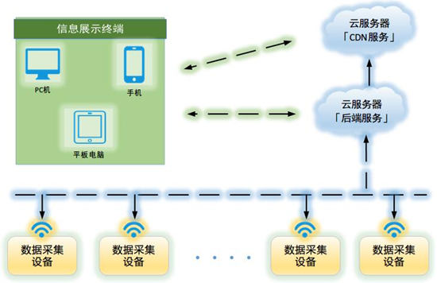
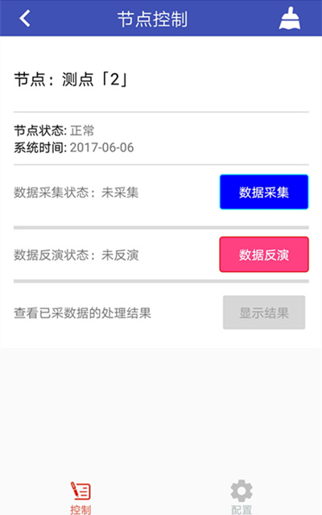
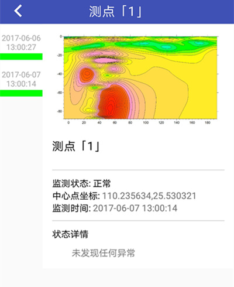

# 数据采集及云端监控系统

使用数十台设备对堤坝渗漏灾害进行全天候、全方位的数据采集及分析处理，管理人员通过
Android 应用实时控制各设备的工作，该系统可通过 Android 应用对工作人员进行灾害预警。

## 项目成果

- 第十二届中国研究生电子设计竞赛华南赛区一等奖

- 第十五届“挑战杯”全国大学生课外学术科技作品竞赛华南赛区一等奖

**参赛并获奖的作品视频展示已上传至B站，请点击观看：**

[中国研究生电子设计竞赛 - 华南赛区一等奖 - 数据采集及云端监控系统](https://www.bilibili.com/video/BV1Ay4y1b7aw/)

## 系统整体设计

## 技术特点

- 单个硬件设备通过 64 个采集电极，采集大地电压、电流数据， PC 机、 .NET 客户端实时读取这些数据，通过正反演算法生成大地电阻率信息，自动分析地质状况并生成直观展示图。

- .NET 客户端与硬件设备通过局域网或串口进行通信， 通信方式可自由切换。

- .NET 客户端生成数据采集策略，并控制硬件设备进行数据采集，并实时分析已采数据。

- .NET 客户端将算法运算结果上传至 Bmob 后端云，直观展示图上传至七牛云存储。

- Android 应用通过 Bmob 后端云和七牛云存储， 实时获取地质监测结果， 实时获取各
个 .NET 客户端的工作状态，并远程控制各客户端进行工作。

## PC 服务端和设备模拟客户端

基于 WPF 框架和 C# 的 .NET 演示程序，分为客户端和服务端：

- 客户端以自定义帧的形式按序向服务端发送数据

- 服务端根据收到的信息生成多个通道的自定义帧发送至客户端，以实现客户端对服务端的自动化数据采集工作。

- 客户端通过自定义帧控制服务端程序生成自定义数据并进行回传，同时客户端同步将数据存储在本地，方便后续的处理使用。

### 技术特点

- 支持「TCP」和「串口」两种通信方式，TCP协议可用于建立客户端和服务端的连接进行演示。

- 客户端发出一条自定义帧，即可收到所有通道的数据，并进行可视化显示。

- 客户端发出一条自定义帧后，未收到回复，则客户端将重复发送该条信息，直到客户端收到回复。

- 操作客户端时，手工配置的数据、系统自动生成的数据、通过服务端生成的数据等均被临时缓存 SQLite 数据库中。

- 一次工作结束后，客户端软件可将这些数据通过 Json 格式导出为本地文件进行持久化存储。

## 基于 Android 的远程控制应用

### 技术及作品展示

- 采用百度地图 SDK

- 通过 Bmob 后端云控制各个设备进行工作

- 实时展示远端设备的工作状态及数据处理结果

## 相关文章

- [WPF 下的自定义控件以及 Grid 中控件的自适应](http://www.jianshu.com/p/1526a02f3556)

- [基于 WPF 的酷炫 GUI 窗口的简易实现](http://www.jianshu.com/p/b2b8b0161397)

## [License](https://github.com/bitkylin/InteractionByFrames/blob/master/LICENSE)

> Apache License 2.0
> 
> A permissive license whose main conditions require preservation of copyright and license notices. Contributors provide an express grant of patent rights. Licensed works, modifications, and larger works may be distributed under different terms and without source code.

## 关于我

### 1. 我的主页

名称|域名|原始地址
---|---|---
主页|http://bitky.cc|https://bitkylin.github.io
GitHub|http://github.bitky.cc|https://github.com/bitkylin
简书|http://js.bitky.cc|http://www.jianshu.com/u/bd2e386a6ea8
CSDN|http://csdn.bitky.cc|http://blog.csdn.net/llmmll08

### 2. 其他

- 兴趣方向: Java, Android, C#, JavaScript, Node.js, Kotlin 等

- Email: bitkylin@163.com
